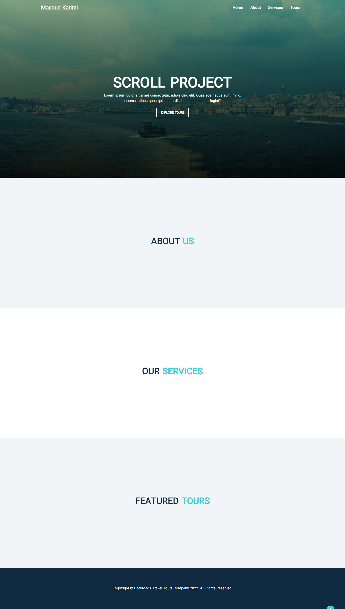

# Scroll

## Screenshot

## Technologies Used:
- HTML
- CSS
- Javascript
   - getBoundingClientRect()
   - pageYOffset
   - slice
   - offsetTop

## Explanation
`element.getBoundingClientRect()` method returns the size of an element and its position relative to the viewport.

`pageYOffset` is a **read-only** window property that returns the number of pixels the document has been scrolled vertically.

`slice` extracts a section of a string without modifying the original string

`offsetTop` - A Number, representing the top position of the element, in pixels