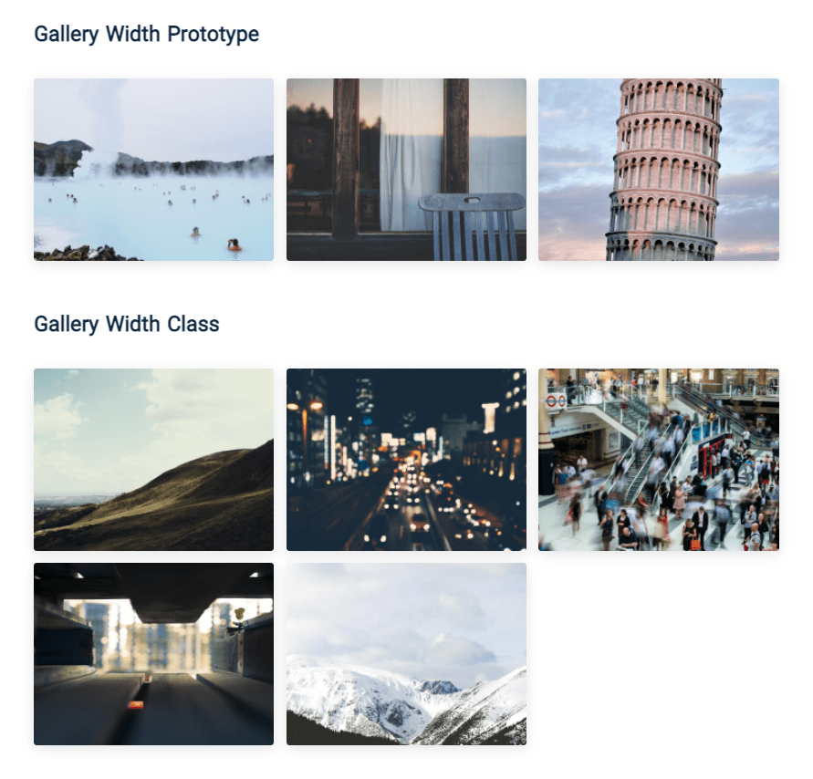

# Simple gallery

## Screenshots

## Technologies Used:
- HTML
- CSS
- Javascript
   - Class
   - Prototype
   - bind
   - Event
      - addEventListener
      - removeEventListener
   - map
   - DOM
      - innerHTML
      - querySelector
      - querySelectorAll
      - classList
         - contains
         - remove
         - add
      - firstElementChild
      - lastElementChild
      - nextElementSibling
      - previousElementSibling

