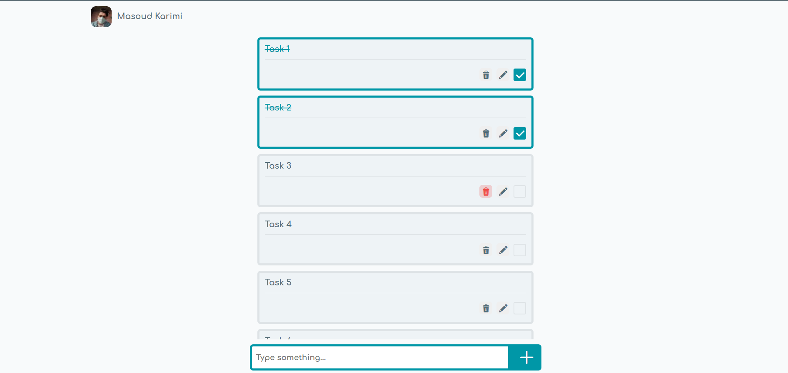

# Todo list with JavaScript

## Screenshot

## Technologies Used:
- HTML
- SASS
- Javascript

## Features
- Stores data in `localStorage`
- Uses the `SweetAlert2` module to display messages
- `CRUD` operations on tasks